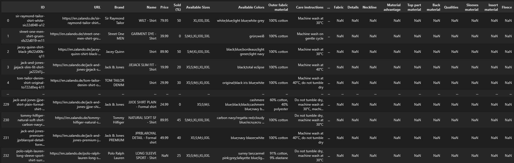

# Notes

The project deliverable is a python package created specifically to scrape data from `zalando.de` website.

__NB__ : It is preferable to use either `Python 3.10.10` or `Python 3.8.10`.

<br>

# Instructions

## Prepare the environement

<br>

- Unzip the `zalando_de_project.zip` and Open a terminal.

- Change directory to the main folder `zalando_de_project/`.

- Create a virtual environment ( e.g. `python3 -m venv ./py_venv` ).

- Activate the created environment ( e.g. `source ./py_venv/bin/activate` ).

- Install the package ( e.g. `pip3 install .` ).

<br>

## Test (unit-tests)

<br>

- Test the environment ( e.g. `pytest zalando_de/unit_tests -rA` ). 

<br>

## Run

<br>

- Run the script `zalando_de_project/main.py` : `python3 main.py`

<br>

# Script Decription

<br>

- The script is designed to be able to keep runing for a long time unless a `Fatal Error` occured.
- After runing the script for the first time, it will run to scrape all `men's shirts` avaialable on the website. Each time it faced a simple issue, a `Timeout` exception for instance, it will skip the current article and continue to the next.
- All the skipped articles are saved into a separate file, so the second run will read them and try to scrape them again.
- For `Fatal errors`, the script will stop for a while, and ask you to confirm by typing `y` (yes) to re-try and continue the scraping process.

    ```
    The browser was recently forcibly closed or the internet connection was unstable.
    Do you want to re-try ? (y/n) :  
    ```
    > __NB 1__ : Sometimes, the script will detect an `Error` that was not expected and it will stop by itself.\
    For instance, this error can be a stale article that was replaced by another one by the server which is not controlable, and hence it stop from execution.\
    In such cases, all you need to do i to re-run the script using the previous command ( `python3 main.py` ) and it will continue from where it stoped.\
    After each re-run you can check the logs streamed to `output/log/logging.log` and see what was the issue to verify if it was random, or caused by an error in the code.

    >__NB 2__: If you figured out that there was an issue with the code or you could not see what caused the exception, I will be avaialable all the time to help.

<br>

# Outputs Description

The output is composed of multiple files :

- `output/data/metadata.json` : This file stores the metada data of each time you ran the scripts.

    ```json
    {
    "20230414_004510": {
        "started_at": "2023-04-14 00:08:04",
        "total_pages": 202,
        "total_items": 16905,
        "processed_articles": 234,
        "skipped_articles": 2,
        "finished_at": "2023-04-14 00:45:10",
        "done_in": "0 days, 0 hours, 37 minutes, and 6.180 seconds"
    }
    }
    ```
- `output/data/skipped_shirts.json` : This file stores the skipped articles in the last time the script ran. This is usefull to check after the script finished if there is any article not scrape, so you can re-run the script to re-scrape them.

    ```json
    {
        "indicode-jeans-shirt-white-ij022d03r-a12": "TimeoutException",
        "shelby-and-sons-devon-shirt-formal-shirt-whiteblue-shf22d00v-k11": "TimeoutException"
    }

    ```

- `output/data/zalando_de_mens_shirts(uncleaned).json` : This file stores all the details of each scraped article. The details in this file are the same as they are on the website : Not cleaned.

    ```json
    {
        "20230414_004510": {
            "metadata": {
                "started_at": "2023-04-14 00:08:04",
                "total_pages": 202,
                "total_items": 16905,
                "processed_articles": 234,
                "skipped_articles": 2,
                "finished_at": "2023-04-14 00:45:10",
                "done_in": "0 days, 0 hours, 37 minutes, and 6.180 seconds"
            },
            "data": {
                "sir-raymond-tailor-shirt-white-sic22d048-a12": {
                    "brand_name": "Sir Raymond Tailor",
                    "article_name": "WILT - Shirt",
                    "price_label": "39,95 € |  | VAT included |  | Originally: |  | 79,95 € |  | -50%",
                    "available_sizes": {
                        "S": {
                            "count": "Notify Me",
                            "price": ""
                        },
                        "M": {
                            "count": "Notify Me",
                            "price": ""
                        },
                        "L": {
                            "count": "Notify Me",
                            "price": ""
                        },
                        "XL": {
                            "count": "Only 1 left",
                            "price": ""
                        },
                        "XXL": {
                            "count": "Only 1 left",
                            "price": ""
                        },
                        "3XL": {
                            "count": "Only 2 left",
                            "price": ""
                        }
                    },
                    "available_colors": [
                        "white",
                        "blue",
                        "light blue",
                        "white grey"
                    ],
                    "other_details": {
                        "Material & care": {
                            "Outer fabric material": "100% cotton",
                            "Care instructions": "Machine wash at 30°C"
                        },
                        "Details": {
                            "Collar": "Button down",
                            "Fastening": "Button",
                            "Pattern": "Striped",
                            "Article number": "SIC22D048-A12"
                        },
                        "Size & fit": {
                            "Our model's height": "Our model is 180 cm tall and is wearing size M",
                            "Fit": "Regular Fit",
                            "Shape": "Straight",
                            "Length": "Normal",
                            "Sleeve length": "65.5 cm (Size M)",
                            "Total length": "75 cm (Size M)"
                        }
                    },
                    "url": "https://en.zalando.de/sir-raymond-tailor-shirt-white-sic22d048-a12.html",
                    "scraped_in": "Apr 14, 2023 00:08:19"
                }
            }
        },
        "20230414_004510": {...},
        ...
    }
    ```

- `output/data/zalando_de_mens_shirts.csv` : This file represents the final desired data, and it contains the same data as the previous JSON file, but it's all cleaned. 

    

    The main columns ( `more than 35` ) the CSV file contains are : 

    ```python
    [
        "ID", "URL", "Brand", "Name", "Price", "Sold (%)", "Available Sizes", "Available Colors",
        "Outer fabric material", "Care instructions", "Our model's height", "Fit", "Shape", "Length",
        "Sleeve length", "Total length", "Collar", "Fastening", "Pattern", "Article number",
        "Lining", "Contains non-textile parts of animal origin", "Back width", "Sheer", "Fabric",
        "Details", "Neckline", "Material advantage", "Top part material", "Back material",
        "Qualities", "Sleeves material", "Insert material", "Fleece", "Scrape Date"
    ]
    ```